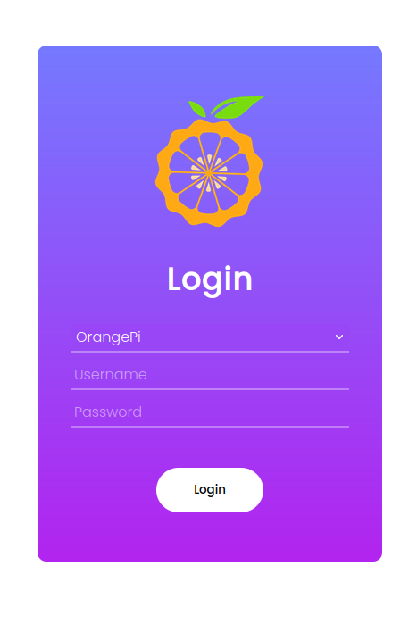
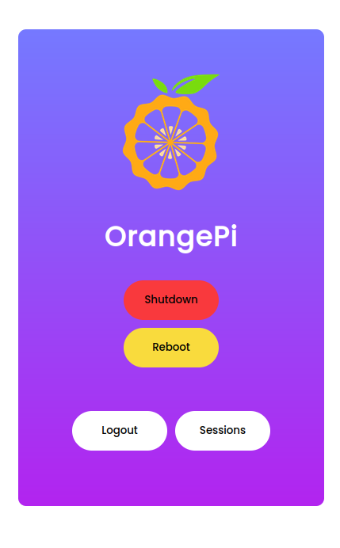
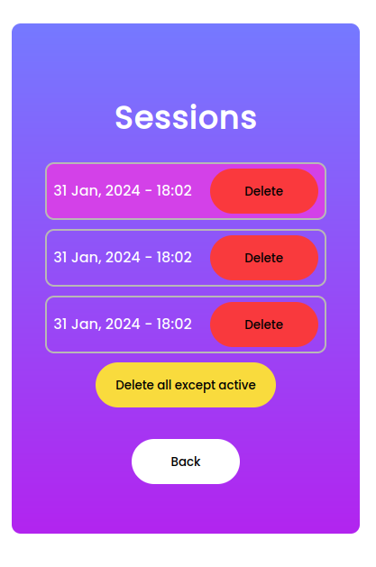

Web-angular application for api to test jwt tokens
----
This application can shutdown or reboot servers. To to add servers need add new record to ```src/assets/config.json```. Server images are stored in ```src/assets/img/*```.

#### In ```src/app/services``` stored all logic with JWT tokens interaction.

- ```local-storage/local-storage``` - wrapper to use js localStorage

- ```auth/account``` - managing JWT tokens 
    - can login on FastApi server
    - can get new access_token when it spoiled, by refresh_token
- ```auth/config``` and ```auth/api``` - logic associated with obtaining data about the api selected by the user

- ```api/power``` and other - create new request to tha api


# Start

    npm install 
    ng serve

# Screenshots



